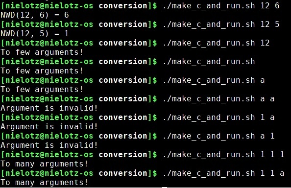
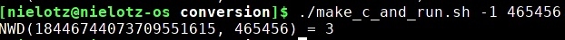

# Calculate iteratively Greatest Common Divisor (with some input checking) in Assembly.

## Sample usage
 
Negative numbers are not handled properly (range: <0, MAX_UNSIGNED_LONG_LONG>). 
 
## How to run.
On linux: 
- Add priviledge to run: 
chmod +x make_c_and_run.sh 
- then start 
./[make_c_and_run.sh](make_c_and_run.sh)
